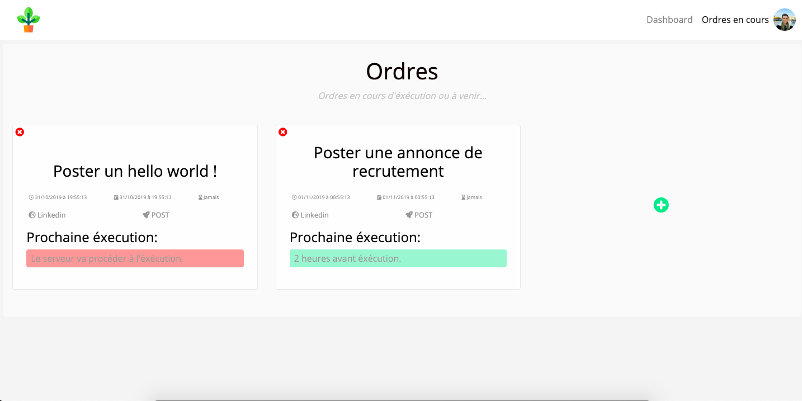

# Botanik
  

## Your networks manager !

You won't manage your network by yourself anymore, let Botanik do that for you !  
It combines a pretty simple web interface and an automated scrapping script both running independently of each other.   

Just feed the application with your orders and it will manage to execute your order at time, and at the frequency you choosed  :   

  
  
  
When job is done, you can check execution's logs of your order in the dashboard. Any issue reported by Botanik? Just click the log and change the order for futures executions.  

  
  

If you follow our tutorial to set up Botanik on a personal server (for instance your Raspberry Pi) you will be able to access it everywhere ! What about your phone?  

  

A sample will soon be available on the following website :  
http://botanik.network

## Set Botanik on your Raspberry PI 
Botanik is performing webscrapping with a multi-process system. Therefore, we truely recommand you to use at least a Raspberry PI 3B+.  
   

**_Tutorial is comming soon._**  

## Botanik's basckstage : Botascript  

Botanik runs a script in the background to execute orders fed by clients in Botaserver's database. It's using Selenium Ruby's gem to run Google Chrome in headless mode and do scrapping job that clients required.  
 

As a browser is runned, we need a graphical server, which means Linux server does not suit for our purpose.  

Furthermore, Botascript of Botanik v 1.0.0 runs implementing multi-processing execution. It is necessary to handle orders execution very close in time and long to process. Be aware that requesting orders very close and resources-intensive can lead to discripencies depending on your server's OS and your hosting computer.   

For this version, Botascript is only able to get HTML elements based on their attributes, a more sustainable way would be to detect visual patterns by implementing such algorithm and hence process orders.  
 
**WARNING: Botascript's language has been changed a short time ago**, which means it does not match it's old possiblities. Indeed, Botascript was developed in Python, but we chose to switch to Ruby to be consistent with Botaserver's language as we did not found pros to stay with two different language for this project.  Pleas note:

- Only the ADD function for Linkedin is available for Botanik v1.0.0.  

- Multi-processing for botascript is a 3-layers system :
	- **First layer runs a database check every minutes**, to verify if there is new orders to execute.
	- **Second layer manage multiple orders requesting execution at the same time**, it controls processes on the execution's layer, make the link with database, and decide to cut them if their execution is too long.  
	- **Third layer is the execution processes layer**, which incorporate every script performing webscrapping. It executes orders and report to the second layer any successes or errors it encounters.

	
## Botanik's backstage : Botaserver  

Botanik runs an interface developed with Ruby On Rails Framework - 5.2.3.  
Botaserver is the input side of Botanik, which means it handles every human interactions and feed the database. It also owns the database of Botanik, which means that Botascript, the operational part of Botanik, is connected to Botaserver's database.  

User interface need to be strengthen and is minimalist for Botanik v 1.0.0

Botaserver use Devise's gem for user identification, which provides us with a good way to secure passwords.    

**WARNING: Contrary to User's passwords, network's passwords are stored as plain-text as Botascript will use them for scrapping purpose. Therefore, it is recommended to change your network's password before providing them to Botanik to avoid any unpleasant surprise.**
  
  
## Contributing to Botanik  

Botanik is an Open Source project. If you want to suggest new features or enhancement feel free to fork the project on your side and make a pull request here.    

As it's always better to document your code please provides us with a Github Issue to explain your code and the feature you want to add.  
 
 
**Notes: Please don't use this project for commercial purpose.  
Also, make its use personal and don't make it available for a large population. Botanik is a tool to allow you to manage your personal networks and have a better experience with social networks. Please remember to always fit to social networks policies, any wrong usage of Botanik is under your own responsability.**
